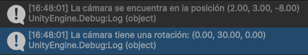
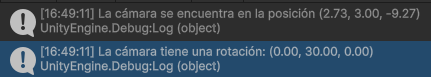
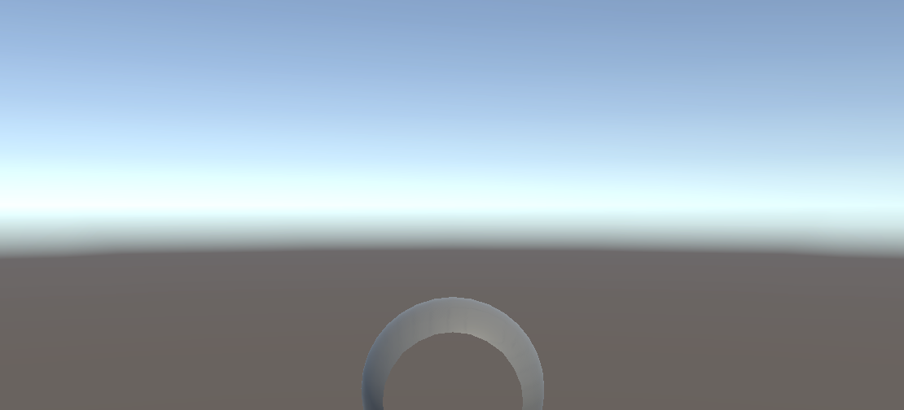
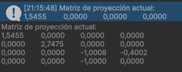
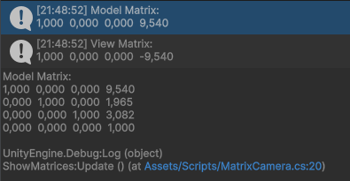
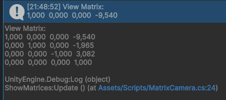
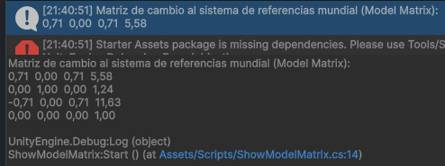
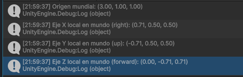

# PrototipoInterfacesInteligentes
1. Qué funciones se pueden usar en los scripts de Unity para llevar a cabo traslaciones, rotaciones y escalados. 

En Unity, existe una gran cantidad de  funciones que se pueden usar para realizar traslaciones, rotaciones y escalados. Para realizar traslaciones, muchas veces la forma más sencilla de hacerlo es mediante el método Translate() de la clase Transform. Sin embargo, cabe destacar que es muy importante conocer si los ejes del GameObject sobre el que queremos realizar la traslación coincide con los del mundo y, en caso de que no sea así, si queremos realizar el movimiento con respecto a las coordenadas del mundo, que especificaremos con Space.World o por el contrario, queremos que se realice con respecto a los del propio GameObject, que especificaremos por medio de Space.Self, aunque es el argumento por defecto. En el caso de que el objeto sea físico, tendremos que hacer uso de los métodos inherentes del Rigidbody para no entrar en conflicto con el motor de físicas. En ese caso, tendremos a nuestra disposición otra serie de métodos como el Rigidbody.MovePosition() para un movimiento más controlado o el AddForce() si sólo queremos emplazar la dirección inicial del movimiento, pero queremos que el motor de físicas se encargue del resto.
En cuanto a la rotación, la forma más popular de realizar algún cambio es por medio de Cuaterniones. Sin embargo, Unity provee de suficientes herramientas como para no tener que implicarse demasiado con ellos. Simplemente es necesario especificar la rotación que se desee realizar mediante los ángulos de Euler, para luego hacer la traducción a un Cuaternión mediante el método Quaternion.Euler. Finalmente, para añadir la rotación deseada a la del GameObject, debemos llamar al método Slerp de la clase Quaternion, que permite interpolar entre el quaternion actual del GameObject, que pasamos como primer argumento, y el que contiene la rotación deseada, que pasamos  como segundo, a una velocidad indicada como tercer parámetro.. Aunque también es posible realizar la rotación sin interpolación igualando la rotación del transform a la que hemos calculado.

2. Como trasladarías la cámara 2 metros en cada uno de los ejes y luego la rotas 30º alrededor del eje Y?. Rota la cámara alrededor del eje Y 30ª y desplázala 2 metros en cada uno de los ejes. ¿Obtendrías el mismo resultado en ambos casos?. Justifica el resultado

Resultado de trasladar y luego rotar:

Resultado de rotar y luego trasladar:

3. Sitúa la esfera de radio 1 en el campo de visión de la cámara y configura un volumen
de vista que la recorte parcialmente.

Para realizar esta tarea, hemos colocado la cámara en la posición estándar (0, 1, -10) y luego hemos creado una esfera que hemos ubicado en (0, 0, -5). Para lograr recortar parcialmente la esfera, hemos modificado tanto su campo Near, que hemos aumentado para que deje de ver parte de la esfera al estar demasiado cerca, dándole un valor de 4.65, y luego hemos reducido también su ángulo de apertura hasta un valor de 25.3, con el objetivo de reducir el campo de visión de la cámara y hacer que perdiera de vista la parte baja de la esfera, obteniendo el siguiente resultado:

4. Sitúa la esfera de radio 1 en el campo de visión de la cámara y configura el volumen
de vista para que la deje fuera de la vista.

Esta labor se puede realizar mediante diferentes vías. Primero de todo, se puede modificar su campo Near, para que comience a ver elementos que se encuentran más lejos de la cámara que la propia esfera. También es posible alterar su campo Far para que sólo vea objetos que queden más cerca que la posición a la que se encuentra la esfera. Por último, dado que la cámara y la esfera se encuentran a una altura diferente, también se podría cambiar el ángulo de apertura de la cámara para lograr que se enfoque en un punto que se encuentre por encima de la propia esfera.

5. Como puedes aumentar el ángulo de la cámara. Qué efecto tiene disminuir el ángulo de la cámara.

Para aumentar el ángulo de la cámara, hay que modificar el campo Field of View del inspector de propiedades de la cámara en Unity. El efecto de disminuir el ángulo de cámara, es que la visión de la misma se verá mucho más enfocada en un punto, haciendo que los planos los planos del frustum que compone la visión de la cámara sean mucho más pequeños y, en consecuencia, haciendo que todo se vea más grande.

6. Es correcta la siguiente afirmación: Para realizar la proyección al espacio 2D, en el inspector de la cámara, cambiaremos el valor de projection, asignándole el valor de orthographic

La afirmación es cierta, puesto que al cambiar el tipo de cámara a ortográfica, se cambia el la forma de proyección de la cámara, que deja de ser un frustum y pasa a ser algo parecido a un prisma, que no deforma el tamaño de los objetos según la distancia, sino que los mantiene todos iguales, logrando de esa forma perder ese grado de profundidad y alcanzando el objetivo de obtener una visión en dos dimensiones.

7. Especifica las rotaciones que se han indicado en los ejercicios previos con la utilidad
quaternion.

El propio ejercicio ya se resolvió con la utilidad quaternion.

8. ¿Como puedes averiguar la matriz de proyección en perspectiva que se ha usado
para proyectar la escena al último frame renderizado?.
9. ¿Como puedes averiguar la matriz de proyección en perspectiva ortográfica que se
ha usado para proyectar la escena al último frame renderizado?.
10. ¿Cómo puedes obtener la matriz de transformación entre el sistema de coordenadas
local y el mundial?.
11. Cómo puedes obtener la matriz para cambiar al sistema de referencia de vista

12. Especifica la matriz de la proyección usado en un instante de la ejecución del
ejercicio 1 de la práctica 1.

[Este script](scripts/ShowProjectionMatrix.cs) nos permite obtener la cámara deseada y mostrar su matriz de proyección. 

13. Especifica la matriz de modelo y vista de la escena del ejercicio 1 de la práctica 1.

Utilizamos [este script](scripts/ShowMatrices.cs) para mostrar las matrices correspondientes de la cámara.

Acceso a la matriz de modelo de la cámara principal:

Acceso a la matriz de vista de la cámara principal:

14. Aplica una rotación en el start de uno de los objetos de la escena y muestra la matriz
de cambio al sistema de referencias mundial.

En [este script](scripts/ShowModelMatrix.cs) aplicamos los cambios especificados sobre un objeto y luego mostramos su matriz de cambio al sistema de referencias mundial, es decir, su matriz de modelo (localToWorldMatrix) después de la rotación.

15. ¿Como puedes calcular las coordenadas del sistema de referencia de un objeto con
las siguientes propiedades del Transform:?:
Position (3, 1, 1), Rotation (45, 0, 45)

Para realizar el cálculo manual, deberíamos calcular las matrices de rotación parciales (una para la rotación en X, `Rx` y otra para la rotación en Z, `Rz`). A partir de ambas, obtenemos la matriz de Rotación combinada (`R = Rz * Rx`). Cada columna de esta matriz indica cómo queda orientado un eje local en el mundo.

Posteriormente, deberemos incluir la posición espcificada (3, 1, 1). Podemos verificar los efectos de estos cambios en [este script](scripts/PositionComprobation.cs).

16. Crea una escena en Unity con los siguientes elementos: cámara principal, plano
base (como suelo) y tres cubos de distinto color (rojo, verde, azul) colocados en
posiciones distintas en el espacio. Realiza un pequeño script de depuración adjunto
a la cámara que permita visualizar en consola o en pantalla las matrices de
transformación (Model, View, Projection) y sus resultados sobre un vértice de cada
cubo.
17. Dibujar en un programa de dibujo el recorrido de las coordenadas de un vértice
específico del cubo rojo:
Local → World → Camera/View → Clip → NDC → Viewport. Indicar cómo cambia su
valor en cada espacio. Aplicar la transformación manualmente a un punto (por
ejemplo, el vértice (0.5, 0.5, 0.5)) y registrar los resultados paso a paso.
18. Mover o rotar uno de los cubos y mostrar cómo cambian los valores de su matriz de
modelo. Rotar la cámara y mostrar cómo se modifica la matriz de vista. Cambiar
entre proyección ortográfica y perspectiva y comparar las diferencias numéricas en
la matriz de proyección.
